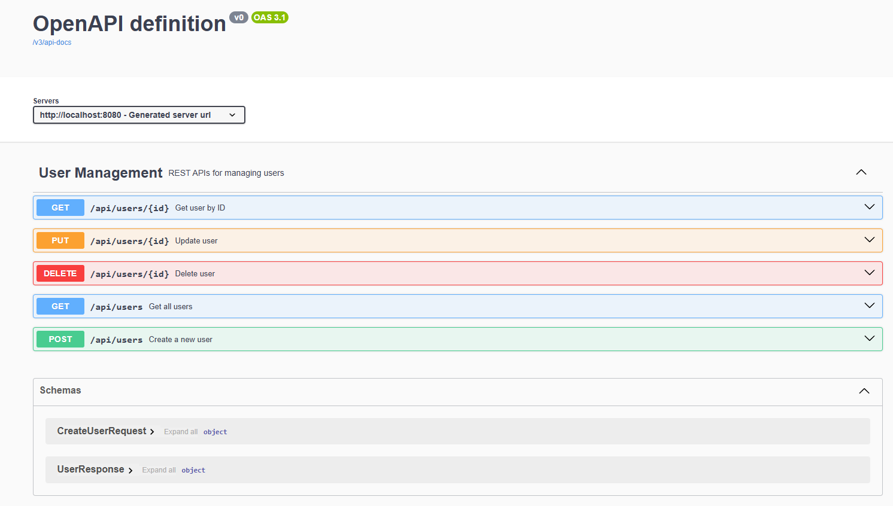

# User Management REST API

A production-style **User Management REST API** built using **Java 25**, **Spring Boot**, **Spring Data JPA**, **Hibernate**, and **MySQL**.

This project demonstrates backend development best practices including layered architecture, DTO pattern, request validation, global exception handling, RESTful API design, Swagger/OpenAPI documentation, CORS configuration, and structured logging.


---

# Project Overview

This application provides REST APIs to manage user information.

The project follows a clean layered architecture:

- Controller Layer
- Service Layer
- Repository Layer
- Entity Layer
- DTO Layer
- Exception Handling Layer
- Configuration Layer

The application uses Hibernate as the ORM framework and MySQL as the relational database.

---

# Features

### User Management

- Create User
- Get All Users
- Get User by ID
- Update User
- Delete User

### Validation

- Request validation using Jakarta Bean Validation
- Required field validation
- Email validation
- Field length validation

### Exception Handling

- Global Exception Handling
- Custom ResourceNotFoundException
- Validation Error Handling
- Standardized Error Response

### API Documentation

- Swagger / OpenAPI Integration
- Interactive API Testing
- 

### Backend Best Practices

- Layered Architecture
- DTO Pattern
- Dependency Injection
- Spring Data JPA
- Hibernate ORM
- MySQL Integration
- Global CORS Configuration
- SLF4J Logging

---

# Technology Stack

| Technology | Version |
|------------|---------|
| Java | 25 LTS |
| Spring Boot | 3.5.x |
| Spring Data JPA | Latest |
| Hibernate | ORM |
| MySQL | 8.x |
| Maven | Build Tool |
| Swagger / OpenAPI | SpringDoc |
| SLF4J | Logging |
| IntelliJ IDEA Community | IDE |
| Git | Version Control |
| GitHub | Repository Hosting |
| Postman | API Testing |

---

# Project Structure

```
src
└── main
    ├── java
    │   └── com
    │       └── nikhil
    │           └── usermanagementapi
    │               ├── controller
    │               ├── service
    │               │   └── impl
    │               ├── repository
    │               ├── entity
    │               ├── dto
    │               │   ├── request
    │               │   └── response
    │               ├── exception
    │               ├── config
    │               └── UserManagementApiApplication.java
    │
    └── resources
        └── application.properties
```

---

# Architecture

```
                Client
                   │
                   ▼
          REST Controller
                   │
                   ▼
             Service Layer
                   │
                   ▼
          Repository Layer
                   │
                   ▼
         Hibernate / JPA
                   │
                   ▼
                MySQL
```

---

# Database

Database Name

```
user_management_db
```

Table

```
users
```

Columns

| Column | Type |
|----------|------|
| id | BIGINT |
| first_name | VARCHAR |
| last_name | VARCHAR |
| email | VARCHAR |

Primary Key

```
id
```

---

# REST API Endpoints

| Method | Endpoint | Description |
|---------|----------|-------------|
| POST | `/api/users` | Create a new user |
| GET | `/api/users` | Retrieve all users |
| GET | `/api/users/{id}` | Retrieve user by ID |
| PUT | `/api/users/{id}` | Update user |
| DELETE | `/api/users/{id}` | Delete user |

---

# Sample Request

## Create User

**POST**

```
POST /api/users
```

Request Body

```json
{
  "firstName": "Nikhil",
  "lastName": "Yadav",
  "email": "nikhil@example.com"
}
```

Response

```json
{
  "id": 1,
  "firstName": "Nikhil",
  "lastName": "Yadav",
  "email": "nikhil@example.com"
}
```

---

# Validation

The application validates incoming requests using Jakarta Bean Validation.

Implemented validations include:

- @NotBlank
- @Email
- @Size

Example Invalid Request

```json
{
  "firstName": "",
  "lastName": "",
  "email": "abc"
}
```

Returns

```
HTTP 400 Bad Request
```

---

# Exception Handling

Implemented custom exception handling using

- @ControllerAdvice
- @ExceptionHandler

Custom Exception

```
ResourceNotFoundException
```

Example

```
GET /api/users/999
```

Returns

```
404 Not Found
```

with a structured error response.

---

# Swagger Documentation

Swagger UI is available after running the application.

```
http://localhost:8080/swagger-ui/index.html
```

Swagger provides

- Interactive API Documentation
- Request Testing
- Response Visualization

---

# Logging

The project uses **SLF4J** with Spring Boot logging.

Business operations are logged including:

- User Creation
- User Retrieval
- User Update
- User Deletion

---

# CORS Configuration

Global CORS configuration is implemented using

```
WebConfig
```

allowing frontend applications to communicate with the backend.

---

# Running the Project

## Clone Repository

```bash
git clone https://github.com/Nikhil-Portfolio-8206/user-management-api.git
```

---

## Navigate to Project

```bash
cd user-management-api
```

---

## Create Database

Create a MySQL database

```sql
CREATE DATABASE user_management_db;
```

---

## Configure Database

Update

```
src/main/resources/application.properties
```

Example

```properties
spring.datasource.url=jdbc:mysql://localhost:3306/user_management_db
spring.datasource.username=root
spring.datasource.password=YOUR_PASSWORD

spring.jpa.hibernate.ddl-auto=update
spring.jpa.show-sql=true
```

---

## Run the Application

Using Maven

```bash
mvn spring-boot:run
```

Or run

```
UserManagementApiApplication.java
```

from IntelliJ IDEA.

---

# Testing APIs

The APIs can be tested using

- Postman
- Swagger UI

---

# Git Workflow

The project uses Git for version control.

Basic workflow

```bash
git status
git add .
git commit -m "Commit Message"
git push
```

---

# Future Improvements

The following enhancements are planned for future versions of the project:

- Pagination
- Sorting
- Searching & Filtering
- Custom Query Methods
- Unit Testing using JUnit & Mockito
- Docker Support
- JWT Authentication
- Role-Based Authorization
- Spring Security
- CI/CD Pipeline
- Deployment to Cloud

---

# Learning Outcomes

This project helped in understanding

- Spring Boot Fundamentals
- REST API Development
- Layered Architecture
- Spring Data JPA
- Hibernate
- MySQL Integration
- DTO Pattern
- Validation
- Exception Handling
- Swagger/OpenAPI
- CORS
- Logging
- Git & GitHub

---

# Author

**Nikhil**

GitHub

https://github.com/Nikhil-Portfolio-8206

---

# License

This project is created for learning, practice, and portfolio purposes.
